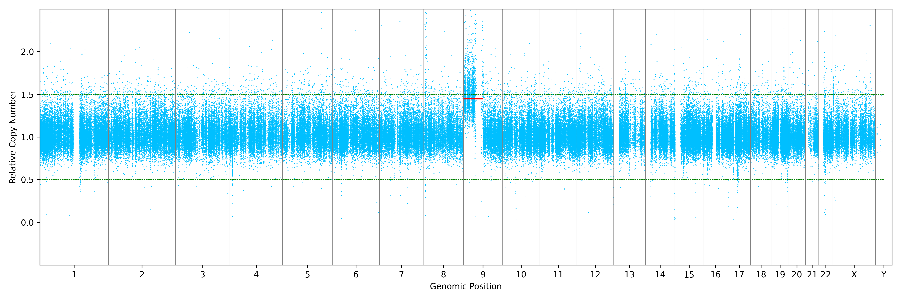

# suncnv

A simple copy number variant caller for target and whole genome sequencing (Panel, WES, WGS).

## Requirements

```bash
# python 3.6+
pip install -r requirements.txt
```

## Usage

## Example

### Count reads

count reads of each region in target.bed for each bam and output `.count` files.

those `.count` files will be used to build the reference in the cnv calling step and can be reused.

```bash
# 21 samples in 9 minutes
./suncnv.py \
    -r normal_bam/*.markdup.bam \
    -b target.bed \
    -o normal_count/

# input
$ ls -1v normal_bam/*.markdup.bam
WES1.markdup.bam
WES1F.markdup.bam
WES1M.markdup.bam
...


# output
$ ls -1v normal_count/
WES1.markdup.count
WES1F.markdup.count
WES1M.markdup.count
...
```

### Call CNV

it can use `.count` or `.bam` file as input, and use `.count` files as reference.

```bash
# .bam input, ~2 minutes
./suncnv.py \
    -i normal_bam/WES1.markdup.bam \
    -r normal_count/*.count \
    -b WES_XP.cnvkit.bed \
    -o WES1 

# .count input, ~10 seconds
./suncnv.py \
    -i normal_count/WES1.markdup.count \
    -r normal_count/*.count \
    -o WES1 

# output
$ tree -h WES1/
WES1/
├── [4.1K]  WES1.markdup.cnv         # cnv segments
├── [ 14M]  WES1.markdup.count       # read counts
├── [ 12M]  WES1.markdup.status      # ratio vs reference
├── [792K]  WES1.markdup.genome.png  # scatter plot of genome

# logs
09:16:30 INFO: sex karyotype of input is xy, x_median=0.6139, y_median=0.7472
09:16:32 WARN: correlation with WES1.markdup.count is 1.0 > 0.99, assume the same sample, skipping
09:16:32 WARN: number of nearest samples is 8 < 20
09:16:32 INFO: median correlation is 0.9327
09:16:32 INFO: nearest samples are WES1F.markdup.count, WES3.markdup.count, WES3F.markdup.count, ...
09:16:32 INFO: building reference
...
```

#### Genome plot



#### Chromosome plot

TODO
